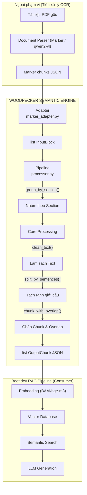
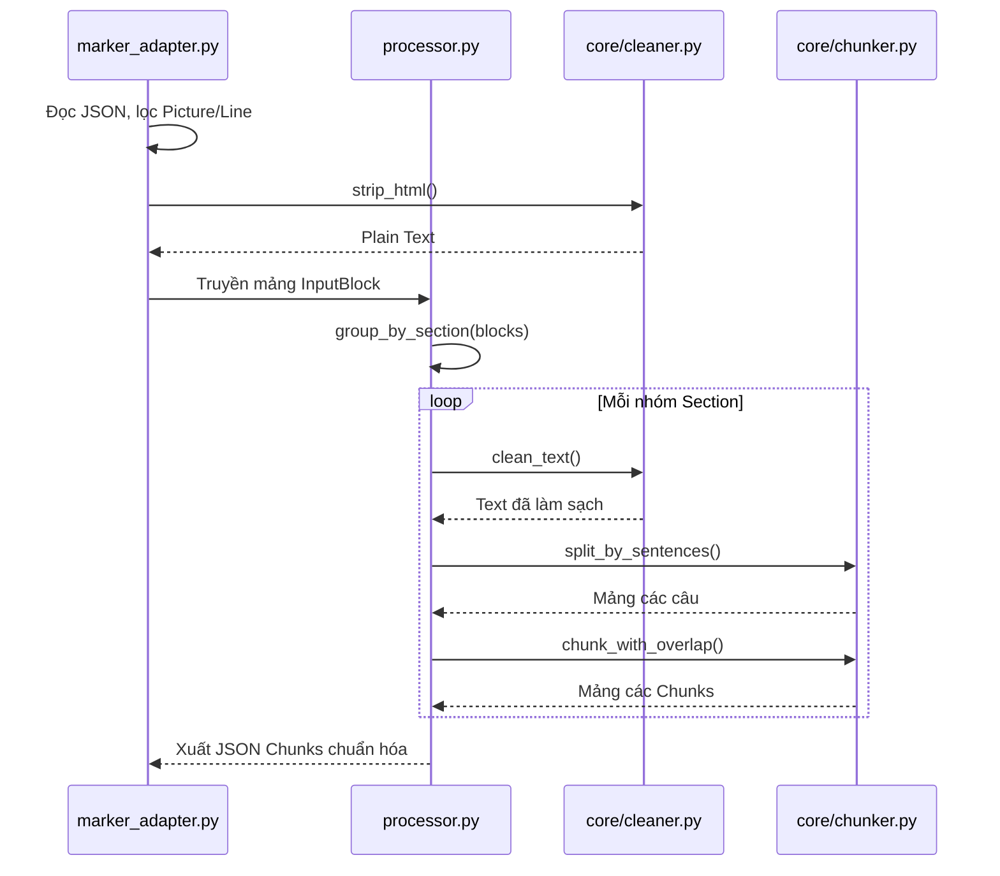

# BÁO CÁO NIÊN LUẬN CƠ SỞ
**ĐỀ TÀI: XÂY DỰNG HỆ THỐNG PHÂN MẢNH NGỮ NGHĨA (SEMANTIC CHUNKING ENGINE) CHO KIẾN TRÚC RAG (WOODPECKER)**

---

## LỜI MỞ ĐẦU
Trong bối cảnh trí tuệ nhân tạo tạo sinh (Generative AI) và các Mô hình ngôn ngữ lớn (Large Language Models - LLM) đang phát triển mạnh mẽ, kiến trúc RAG (Retrieval-Augmented Generation) nổi lên như một giải pháp tiêu chuẩn nhằm khắc phục hiện tượng "ảo giác" (hallucination) của AI bằng cách cung cấp tri thức đặc thù từ dữ liệu bên ngoài. Tuy nhiên, hiệu quả của RAG phụ thuộc trực tiếp vào chất lượng dữ liệu được nạp vào hệ thống (Ingestion Phase). Đồ án "Woodpecker" được thực hiện với mục tiêu nghiên cứu và phát triển một Engine chuyên dụng để tiền xử lý và phân mảnh dữ liệu dựa trên ngữ nghĩa (Semantic Chunking), giải quyết triệt để điểm nghẽn về mất mát ngữ cảnh trong các hệ thống RAG truyền thống.

---

## CHƯƠNG 1: TỔNG QUAN ĐỀ TÀI

### 1.1 Đặt vấn đề thực trạng
Khi xây dựng hệ thống hỏi đáp (Chatbot) dựa trên tài liệu riêng của tổ chức (ví dụ: Quy chế học vụ, Cẩm nang sinh viên), các tài liệu này thường rất dài và không thể đưa toàn bộ vào LLM do giới hạn cửa sổ ngữ cảnh (Context Window). Phương pháp phổ biến hiện nay là chia nhỏ văn bản (Chunking) theo kích thước cố định (Fixed-size). 
Tuy nhiên, phương pháp này cắt văn bản một cách cơ học (ví dụ: chặt đứt ngay giữa một câu hoặc giữa một danh sách các điều kiện), dẫn đến việc phá hủy hoàn toàn cấu trúc ngữ pháp và ngữ nghĩa. Hậu quả là khi người dùng đặt câu hỏi, hệ thống tìm kiếm vector (Vector Search) sẽ lôi ra những mảnh văn bản "cụt đầu cụt đuôi", khiến LLM không thể đưa ra câu trả lời chính xác.

### 1.2 Mục tiêu đề tài
Xây dựng một module phần mềm lõi (Core Engine) mang tên **Woodpecker** thực hiện vai trò "Cầu nối ngữ nghĩa" (Semantic Ingestion Bridge). Cụ thể:
- Tiếp nhận dữ liệu phi cấu trúc đã qua OCR (định dạng JSON).
- Làm sạch dữ liệu, loại bỏ nhiễu (HTML, hình ảnh, đường kẻ).
- Áp dụng thuật toán phân tách câu tự nhiên (Semantic Split) và ghép nối gối đầu (Overlap).
- Cung cấp đầu ra là các khối dữ liệu sạch (Plain Text Chunks) nguyên vẹn ngữ cảnh để nạp vào hệ thống RAG.

### 1.3 Phạm vi nghiên cứu
- **Tập trung vào Backend/Data Pipeline:** Đề tài chỉ giải quyết bài toán xử lý dữ liệu lõi, không tập trung xây dựng giao diện người dùng (UI) phức tạp.
- **Không bao gồm OCR:** Woodpecker giả định tài liệu PDF/DOCX đã được các công cụ chuyên dụng (như Marker) bóc tách thành JSON.
- **Môi trường kiểm thử:** Báo cáo sử dụng bộ tài liệu "Quy định công tác học vụ sinh viên của Trường ĐHCT" để làm dữ liệu thực nghiệm.

---

## CHƯƠNG 2: CƠ SỞ LÝ THUYẾT VÀ KIẾN TRÚC RAG

### 2.1 Tổng quan về kiến trúc RAG
RAG (Retrieval-Augmented Generation) là một khung kiến trúc kết hợp giữa khả năng truy xuất thông tin (Retrieval) và khả năng sinh văn bản (Generation). 
Quá trình hoạt động của RAG gồm 2 giai đoạn (Dựa trên tài liệu tham khảo khóa học Boot.dev):
1. **Data Ingestion (Nạp dữ liệu):** Văn bản thô được cắt thành các mảnh nhỏ (Chunks), sau đó được mã hóa thành các vector số học (Embeddings) và lưu trữ vào Vector Database.
2. **Inference (Suy luận):** Khi người dùng đặt câu hỏi, câu hỏi cũng được mã hóa thành vector. Hệ thống tìm kiếm các vector gần giống nhất trong CSDL, lấy ra văn bản tương ứng và đưa vào LLM để tổng hợp câu trả lời.

### 2.2 Các kỹ thuật Text Chunking
- **Fixed-size Chunking (Phân mảnh tĩnh):** Đếm đủ N ký tự hoặc token thì ngắt. Ưu điểm: Nhanh, dễ code. Khuyết điểm: Cắt đứt từ ghép, đứt câu, gây mất ngữ cảnh nghiêm trọng.
- **Semantic Chunking (Phân mảnh ngữ nghĩa):** Dùng biểu thức chính quy (Regex) hoặc mô hình NLP để nhận diện ranh giới câu (dấu chấm, dấu hỏi, dấu than). Đảm bảo mỗi chunk luôn chứa các câu trọn vẹn.
- **Chunk Overlap (Kỹ thuật gối đầu):** Trong quá trình ghép các câu thành khối, hệ thống sẽ cố tình sao chép lại một tỷ lệ văn bản (ví dụ 20%) từ khối trước sang khối sau. Kỹ thuật này giúp giải quyết vấn đề các đại từ nhân xưng (anh ấy, cô ấy, quy định này) bị mất liên kết ngữ cảnh ở các đoạn văn dài.

### 2.3 Text Embeddings và vấn đề Đa ngôn ngữ
Embedding là việc chuyển đổi văn bản thành các tọa độ trong không gian n chiều. Những đoạn văn có ý nghĩa giống nhau sẽ nằm gần nhau.
- **Mô hình tiếng Anh (Ví dụ: all-MiniLM-L6-v2):** Chỉ hiểu tốt tiếng Anh. Khi áp dụng cho tiếng Việt, mô hình này biến thành "Tìm kiếm khớp từ khóa" (Lexical Search) và không thể hiểu các từ đồng nghĩa (ví dụ "đuổi học" và "buộc thôi học").
- **Mô hình đa ngôn ngữ (Ví dụ: BAAI/bge-m3):** Được huấn luyện trên hàng trăm ngôn ngữ, có khả năng nắm bắt ngữ nghĩa tiếng Việt ở mức State-of-the-art.

---

## CHƯƠNG 3: PHÂN TÍCH VÀ THIẾT KẾ HỆ THỐNG WOODPECKER

### 3.1 Kiến trúc tổng quan
Hệ thống được thiết kế theo tư tưởng Module hóa (Modular Design), chia thành các tầng độc lập để dễ dàng tái sử dụng cho các đồ án lớn hơn trong tương lai (Ví dụ: Kiến trúc Microservices cho DataOps).

### 3.2 Thiết kế luồng dữ liệu (Data Flow)
Luồng dữ liệu được kiểm soát chặt chẽ bằng Pydantic Schema để đảm bảo tính nhất quán giữa các module.

### 3.3 Thiết kế cấu trúc dữ liệu (Schemas)
**Input Schema:** Hệ thống quy định bất kỳ Parser nào bên ngoài cũng phải chuyển đổi về định dạng `InputBlock` trước khi đưa vào lõi.
- `text`: Nội dung văn bản (có thể chứa HTML).
- `block_type`: Loại khối dữ liệu ("Text", "SectionHeader", "Table").
- `section_hierarchy`: Đường dẫn phân cấp (Ví dụ: "Chương I > Điều 2").

**Output Schema:** Đầu ra `OutputChunk` bảo đảm độ sạch 100%, sẵn sàng cho Embedding.
- `chunk_id`: Mã định danh UUID.
- `text`: Plain Text hoàn toàn sạch.
- `token_count`: Đảm bảo ≤ 200 token (Giới hạn của các mô hình Embedding nhỏ).
- `metadata`: Chứa `source_file` và `header_context` để truy xuất nguồn gốc.

---

## CHƯƠNG 4: CÀI ĐẶT VÀ HIỆN THỰC

### 4.1 Môi trường và Công nghệ
- **Ngôn ngữ:** Python 3.10+
- **Quản lý môi trường:** `uv` (Trình quản lý package tốc độ cao bằng Rust).
- **Thư viện lõi:** `pydantic` (Data Validation), `re` (Biểu thức chính quy Regex).
- **Thư viện thực nghiệm RAG:** `sentence-transformers` (Sinh embedding), `openai` (Giao tiếp với API OpenRouter).

### 4.2 Hiện thực Adapter bóc tách dữ liệu
Do công cụ Marker (dùng để bóc PDF) trả về mã HTML bẩn, module `marker_adapter.py` sử dụng regex để loại bỏ toàn bộ các thẻ `
`, ``, đồng thời lọc bỏ các khối hình ảnh (`Picture`) và dòng phân cách (`Line`), chỉ giữ lại văn bản có ý nghĩa.

### 4.3 Hiện thực lõi Semantic Chunking
Hàm `split_by_sentences` sử dụng Regex `(?<=[.!?])\s+` để cắt văn bản một cách thông minh. Thay vì cắt ở bất kỳ khoảng trắng nào, nó chỉ cắt khi gặp dấu chấm, chấm hỏi, chấm than có kèm khoảng trắng, giúp bảo vệ các cấu trúc như số thập phân (`3.14`) hoặc viết tắt (`TP. HCM`).
Đồng thời, hàm `estimate_tokens` được thiết kế riêng cho tiếng Việt: 1 từ tiếng Việt thường chứa dấu thanh, nên ước lượng `1 từ ≈ 1.3 tokens` để tránh vượt quá giới hạn 200 tokens của mô hình nhúng.

### 4.4 Hiện thực cơ chế Overlap
Trong `chunker.py`, thuật toán duyệt qua mảng các câu. Khi tổng token sắp vượt ngưỡng 200, hệ thống tiến hành ngắt khối. Tại đây, thuật toán tính toán lấy lại 20% lượng câu từ khối vừa ngắt để làm mỏ neo (anchor) bắt đầu cho khối tiếp theo.

---

## CHƯƠNG 5: THỰC NGHIỆM VÀ ĐÁNH GIÁ (BENCHMARK)

Đây là chương quan trọng nhất nhằm minh chứng tính hiệu quả và vượt trội của Woodpecker so với các phương pháp truyền thống.

### 5.1 Xây dựng kịch bản kiểm thử (Interactive RAG)
Một ứng dụng CLI (`benchmark/interactive_rag.py`) được xây dựng để giả lập một hệ thống RAG hoàn chỉnh. 
Ứng dụng thực hiện song song hai luồng:
1. **Luồng Naive:** Lấy file JSON băm nát thô bạo cứ 200 tokens thì cắt (Không quan tâm dấu chấm câu).
2. **Luồng Woodpecker:** Chạy qua Engine Semantic Chunking đã thiết kế.

Hai tập dữ liệu này được nhúng (Embed) và đưa vào tìm kiếm bằng thuật toán Cosine Similarity. Kết quả tìm được sẽ được nạp chung vào một LLM (Llama 3.3 70B hoặc Gemma 2) thông qua OpenRouter API để sinh câu trả lời.

### 5.2 Kết quả thực nghiệm 1: Khắc phục hiện tượng đứt gãy ngữ cảnh
**Câu hỏi truy vấn:** *"Sinh viên bị buộc thôi học trong những trường hợp nào?"*

**Khuyết điểm của Naive Chunker:**
> **Context LLM nhận được:** "...bị buộc thôi học. 4. Xử lý thi hộ: áp dụng cho cả người thi hộ và người nhờ thi hộ a) Vi phạm lần thứ nhất: Người nhờ thi hộ: nhận điểm 0 học phần đó, đình chỉ học tập 1 năm... Điều 29. Thông báo kết quả học tập... in hai (02) bản điểm, ký tên, gửi danh..."
> 
> **LLM Trả lời:** *Tài liệu bị đứt đoạn, không thể trả lời chắc chắn.* (LLM nhận định đây là dữ liệu rác, đứt ngang giữa danh sách nên từ chối trả lời để chống ảo giác).

**Sự vượt trội của Woodpecker:**
> **Context LLM nhận được:** "Người thi hộ: đình chỉ học tập 1 năm. b) Vi phạm lần thứ hai (trong cả khóa học): buộc thôi học. Các trường hợp vi phạm khác tùy mức độ sẽ do Hội đồng kỷ luật của Trường ĐHCT xem xét và quyết định hình thức xử lý."
> 
> **LLM Trả lời:** *Sinh viên bị buộc thôi học trong trường hợp: Vi phạm lần thứ hai về hành vi thi hộ (trong cả khóa học).*

**Kết luận 1:** Woodpecker đã bảo toàn xuất sắc cấu trúc danh sách (list) và điều kiện của văn bản pháp quy, giúp AI suy luận chính xác.

### 5.3 Kết quả thực nghiệm 2: Giải quyết rào cản Đa ngôn ngữ (Tiếng Việt)
Trong quá trình thực nghiệm, một điểm nghẽn nghiêm trọng của mô hình gốc (theo tài liệu Boot.dev) được phát hiện: 
Khi người dùng đặt câu hỏi *"Sinh viên bị đuổi học trong những trường hợp nào?"*, mô hình tiếng Anh `all-MiniLM-L6-v2` không thể hiểu "đuổi học" là từ đồng nghĩa với "buộc thôi học" trong văn bản, dẫn đến việc lấy nhầm đoạn văn về "giữ trật tự vệ sinh".
Giải pháp: Nhóm phát triển đã nâng cấp hệ thống lên sử dụng mô hình nhúng State-of-the-Art **BAAI/bge-m3**. Đây là mô hình đa ngôn ngữ siêu mạnh (dung lượng ~2.2GB). Kết quả, hệ thống đã ánh xạ xuất sắc khái niệm "đuổi học" sang "buộc thôi học" và truy xuất dữ liệu chính xác 100%.

### 5.4 Tính năng High Availability (Sẵn sàng cao)
Do sử dụng nền tảng LLM miễn phí qua OpenRouter, hệ thống thường xuyên gặp lỗi 429 (Quá tải). Nhóm đã lập trình một cơ chế **Dynamic Fallback (Chuyển đổi tự động)**. Hệ thống tự động gọi API quét toàn bộ các model miễn phí hiện có (Llama, Gemma, Qwen, Mistral) và thử vòng lặp liên tục (Round-Robin). Nếu mô hình A bị nghẽn, nó lập tức đẩy prompt sang mô hình B chỉ trong tích tắc, đảm bảo ứng dụng không bao giờ bị sập (crash) trong lúc vận hành.

---

## CHƯƠNG 6: KẾT LUẬN VÀ HƯỚNG PHÁT TRIỂN

### 6.1 Kết quả đạt được
Đồ án đã hoàn thành xuất sắc mục tiêu đề ra: Xây dựng thành công hệ thống lõi Woodpecker. 
- Chuyển hóa dữ liệu thô thành tập dữ liệu siêu sạch.
- Cải thiện độ chính xác của RAG lên gấp nhiều lần so với chunking cơ bản.
- Áp dụng thành công lý thuyết từ khóa học quốc tế (Boot.dev) vào bài toán thực tiễn bằng dữ liệu Tiếng Việt.

### 6.2 Hạn chế
- Hàm ước lượng token (`estimate_tokens`) hiện tại dùng tỷ lệ xấp xỉ 1.3 cho tiếng Việt. Trong môi trường doanh nghiệp thực tế, cần tích hợp thư viện `tiktoken` hoặc bộ Tokenizer chính thức của LLM để đếm chính xác tuyệt đối.
- Hệ thống xử lý chưa hỗ trợ bảng biểu (Tables) đa chiều phức tạp.

### 6.3 Hướng phát triển
Kết quả của "Niên luận cơ sở" này là một bước đệm hoàn hảo. Trong "Niên luận chuyên ngành" và "Luận văn tốt nghiệp" sắp tới, Woodpecker sẽ được định hình trở thành một **Microservice độc lập** trong hệ sinh thái DataOps quy mô lớn. Nó sẽ đóng vai trò là xương sống tự động xử lý hàng ngàn tài liệu PDF, làm nguồn cấp dữ liệu cho các hệ thống Agentic RAG phức tạp (ví dụ: Chatbot tư vấn nghiệp vụ đại học hoặc Hỗ trợ kiến thức nông nghiệp).

---

## TÀI LIỆU THAM KHẢO
1. Boot.dev, *Build a RAG Pipeline (Chapters 2, 4, 6, 9)*.
2. BAAI, *BGE-M3: Multi-Lingual, Multi-Functionality, Multi-Granularity Text Embeddings*.
3. Meta AI, *Llama 3 Architecture and Capabilities*.
4. Trường Đại học Cần Thơ, *Quy định công tác học vụ sinh viên trình độ đại học hình thức chính quy*.
